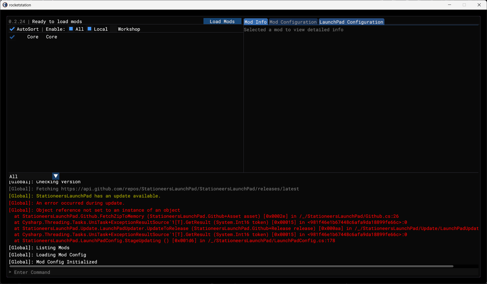
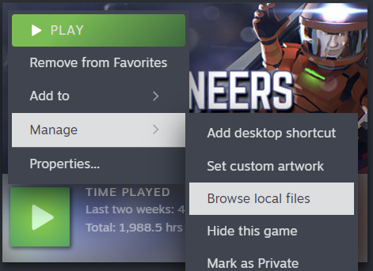
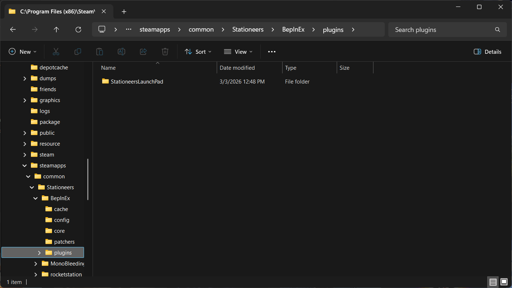
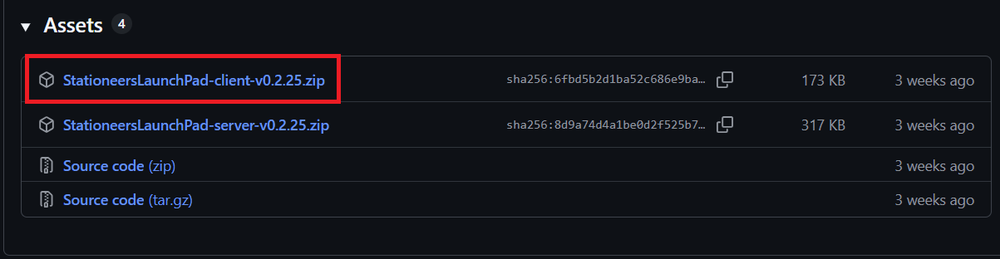
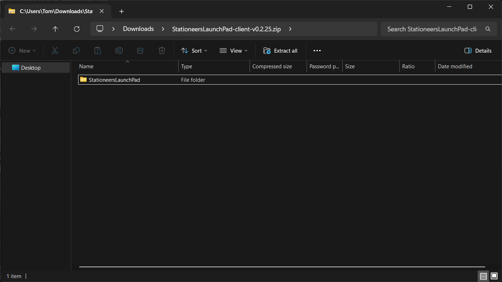
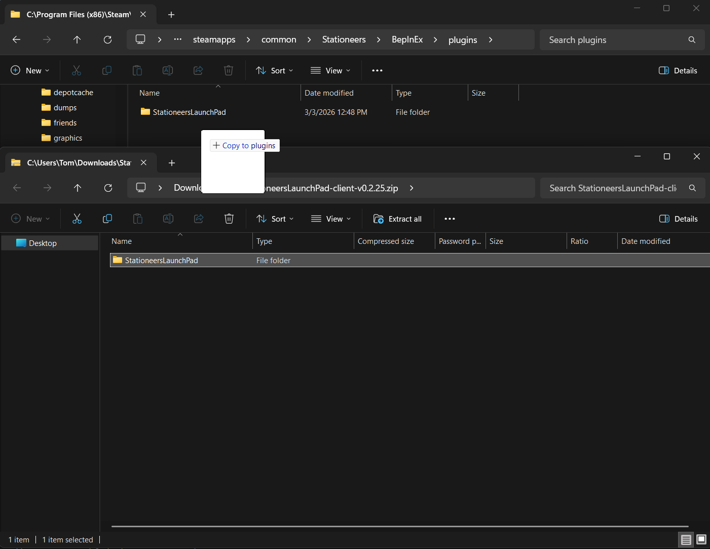
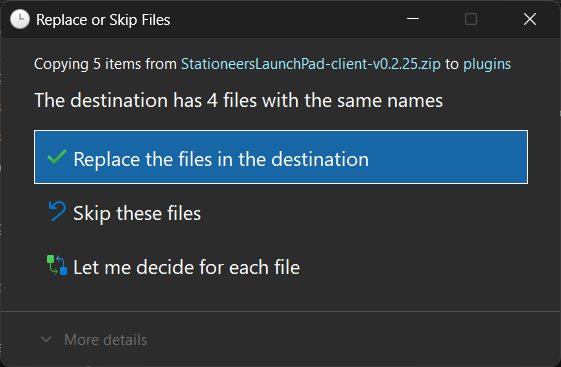

# StationeersLaunchPad v0.2.25 Update Error

Due to a bug in StationeersLaunchPad v0.2.25, when updating to the next version you will encounter a screen containing an error message. You will need to manually update to the next version to bypass this error.
???+ info "Update Error"
    

## Manual Update Process
Please ensure the game is not currently running, and follow these steps to manually update to the latest version. 
If you encounter any issues, please ask for help in the [Stationeers Discord](https://discord.gg/stationeers) #modding channel, or in the [Stationeers Modding Discord](https://discord.gg/5qZbPVTw2U).

### Open Game Files
Open the Stationeers game files and nagivate to the `BepInEx/plugins` directory

???+ info "Open Game Files"
    

???+ info "Navigate to BepInEx/plugins"
    

### Download StationeersLaunchPad
Download and open the `StationeersLaunchPad-client-vX.X.X.zip` file from the [latest release](https://github.com/StationeersLaunchPad/StationeersLaunchPad/releases/latest){target=_blank}

???+ info "Client Download"
    
    Make sure you are downloading a later version than the v0.2.25 pictured

???+ info "Open Zip"
    

### Copy Files
Copy the `StationeersLaunchPad` folder from the client zip into the `BepInEx/plugins` directory, replacing the existing files

???+ info "Copy StationeersLaunchPad Folder"
    

???+ info "Replace Existing Files"
    

### Run Stationeers
The game should now load past the update check without errors
